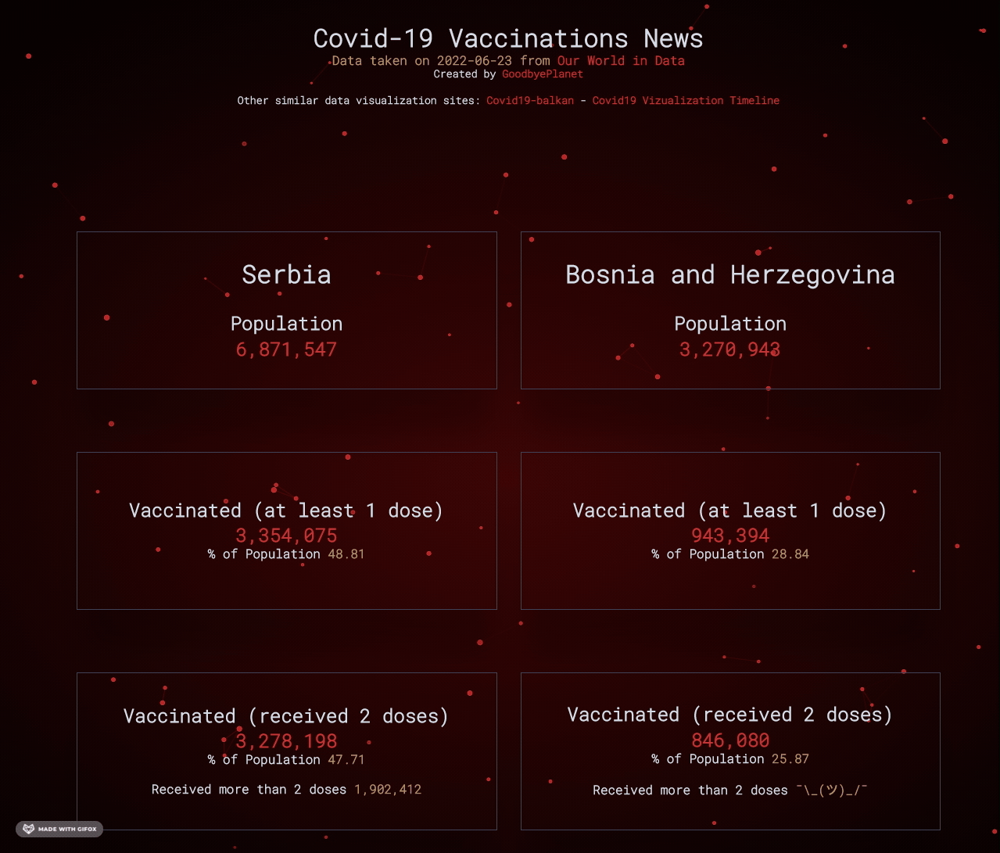

## Project description

This site is taking data from [Our World in Data](https://github.com/owid/covid-19-data/tree/master/public/data).
The purpose of this site is to show the latest data available regarding vaccination in Serbia and Bosnia.

## Available Scripts

In the project directory, you can run:

### `npm run start`

Runs the app in the development mode. 
Open [http://localhost:3000](http://localhost:3000) to view it in the browser.
